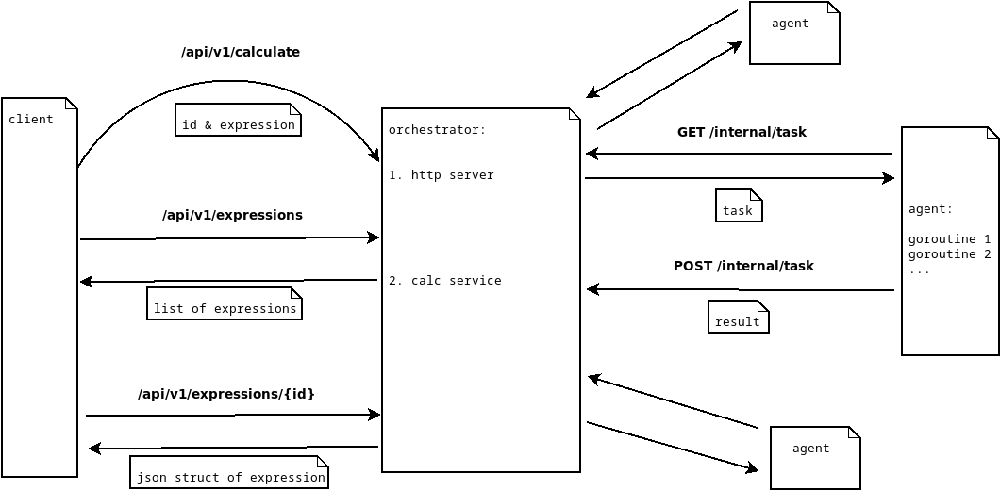

Для связи tg: @neandrs

# go-daev2
Распределенный вычислитель арифметических выражений.


## Проект

Проект состоит из 2 элементов:

- Orchestrator - сервер, который принимает арифметическое выражение, переводит его в
  набор последовательных задач и обеспечивает порядок их выполнения. 
- Agent - вычислитель, который может получить от "оркестратора" задачу, выполнить его и
  вернуть серверу результат.



## Сборка и запуск

Склонируйте репозиторий
```sh
git clone https://github.com/neandrson/go-daev2.git
```
Перейдите в корневой каталог проекта.

### Docker

Собрать приложение состоящее из оркестратора и трех агентов:
```sh
docker compose build && docker compose up
```

Пожалуйста, дождитесь сообщения о том, что сервер начал работу.
На моей машине этот процесс занимает заметное время.


Для того, чтобы запустить контейнеры в фоновом режиме:
```sh
docker compose up -d
```

Для того, чтобы остановить запущенные контейнеры  в фоновом режиме:
```sh
docker compose down
```
или `CTRC-C`, если контейнеры запущены не в фоне.

Чтобы изменять переменные окружения, модифицируйте файл `.env`


### Linux
  - Собрать и запустить оркестратор командой:
  ```sh
  make orchestrator && source scripts/setenv.sh && ./orchestrator
  ```
  - Собрать и запустить agent командой:
  ```sh
  make agent && source scripts/setenv.sh && ./agent
  ```

Для запуска вам понадобится несколько вкладок терминала.
Вы также можете запустить процессы в фоновом режиме, используя символ `&`.
Потоки вывода следует перенаправить в файл, например `/dev/null`.
Например, чтобы запустить агент в фоновом режиме:
  ```sh
  make agent && source scripts/setenv.sh && ./agent 2>1 >/dev/null &
  ```
В таком случае не забудьте, остановить процессы, командой `kill -s SIGINT proccess_id`.
PID процесса можно узнать, с помощью команды `ps`

Чтобы изменять переменные окружения, модифицируйте файл `scripts/setenv.sh`

## Примеры

Все примеры рассчитаны на то, что приложение собиралось через docker compose.
В ином случае указываете порт, который прослушивает сервер - 8081.

### Чтобы добавить арифметическое выражение на вычисление, используйте запросы вида:

```sh
curl --location 'localhost/api/v1/calculate' \
--header 'Content-Type: application/json' \
--data '{
      "expression": "строка_с_выражением"
}'
```

Например:

```sh
curl --location 'http://localhost/api/v1/calculate' \
--header 'Content-Type: application/json' \
--data '{
    "expression": "2+2*2"
}'
```

Коды ответа:
- 201 - выражение принято для вычисления
- 422 - невалидные данные
- 500 - что-то пошло не так

### Чтобы получить список всех выражений, используйте запрос:

```sh
curl --location 'localhost/api/v1/expressions'
```
Тело ответа
```sh
{
    "expressions": [
        {
            "id": <идентификатор выражения>,
            "status": <статус вычисления выражения>,
            "result": <результат выражения>
        },
        {
            "id": <идентификатор выражения>,
            "status": <статус вычисления выражения>,
            "result": <результат выражения>
        }
    ]
}
```
Коды ответа:
- 200 - успешно получен список выражений
- 500 - что-то пошло не так

Пример:
```sh
{
    "expressions": [
        {
            "id": "1741193931256739094",
            "status": "Done",
            "result": "1"
        },
        {
            "id": "1741193939838165597",
            "status": "Error",
            "result": ""
        },
        {
            "id": "1741193966984372546",
            "status": "In process",
            "result": ""
        },
        {
            "id": "1741194091277399012",
            "status": "Done",
            "result": "-Inf"
        }
    ]
}
```
Всего возможно три статуса:
- `Error`:      найдена синтаксическая или грамматическая ошибка в арифметическом выражении
- `In process`: выражение в процессе вычисления
- `Done`:       получен результат выражения

Стоит отметить, что деление на нуль не является ошибкой и будет получен результат.
Это может быть `+inf`, `-inf` (бесконечность) или `NaN` (not a number), если числитель
также был равен или близок к нулю.

### Чтобы получить выражение по его идентификатору, используйте запрос:

```sh
curl --location 'localhost/api/v1/expressions/{id}'
```
Тело ответа
```sh
{
    "expression":
        {
            "id": <идентификатор выражения>,
            "status": <статус вычисления выражения>,
            "result": <результат выражения>
        }
}
```
Коды ответа:
- 200 - успешно получено выражение
- 404 - нет такого выражения
- 500 - что-то пошло не так

Например,
```sh
curl --location 'localhost/api/v1/expressions/1741193931256739094'
```
Тело ответа:
```sh
{
    "expression": {
        "id": "1741193931256739094",
        "status": "Done",
        "result": "1"
    }
}
```
или

```sh
curl --location 'localhost/api/v1/expressions/4'
```
```sh
id "4" not found
```

#### Получение задачи для выполения.
 
```sh
curl --location 'localhost/internal/task'
```
Тело ответа
```sh
{
  "task":
    {
      "id": <идентификатор задачи>,
      "arg1": <имя первого аргумента>,
      "arg2": <имя второго аргумента>,
      "operation": <операция>,
      "operation_time": <время выполнения операции>
    }
}
```
Коды ответа:
- 200 - успешно получена задача
- 404 - нет задачи
- 500 - что-то пошло не так

Например:

```sh
{
    "task": {
        "id": 1,
        "arg1": "1.000000",
        "arg2": "2.000000",
        "operation": "*",
        "operation_time": 1000000000
    }
}
```
